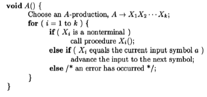

# Proyecto 1 BD2

## Introducción 

Para este proyecto, se nos ha pedido crear y manipular un DataSet usando estrategias de organización de archivos.

### Objetivos
#### Principal
- Conocer el funciomaniento de la manipulación de **metadata** en una base de datos usando estrategias de organización de archivos.
#### Secundarios
- Identificar las ventajas y desventajas de cada estrategia utilizada. 
- Analizar el comportamiento computacional al implementar una base de datos.
- Comprender como funciona la interacción usuario-servidor mediante la implementación de una GUI.

### Organización de Archivos

Las estrategias usadas para este proyecto son las siguientes:

- ISAM-Sparse Index
- Extendible Hashing

### Funciones implementadas

Para cada estretegia, se debe implementar y visualizar las siguientes funciones:

- vector<Registro> search(T key)
- vector<Registro> rangeSearch(T begin-key, T end-key)
- bool add(Registro registro)
- bool remove(T key)

Además, se pide implementó un **parser** y un GUI en QT para una mejor visualización del proyecto.  

### DataSet
hemos usado un dataset de Películas IMBD. Esta elección fue debida a los siguientes factores:
- Los atributos son fáciles de tratar: la mayoría son de tipo string o int.
- Los datos son requeridos obligatoriamente para todos los atributos menos uno: el "certificate". Esto hace que nuestro potencial de valores NULL disminuya considerablemente.
- El DataSet solo consta de una tabla, por lo que facilita su manejo y manipulación para los índices a utilizar.

A continuación, explicamos los atributos del DataSet previamente mencionado.

```c++
struct MovieRecord {
    int dataId{};
    char contentType[16]{'\0'};
    char title[256]{'\0'};
    short length{};
    short releaseYear{};
    short endYear{};
    int votes{};
    float rating{};
    int gross{};
    char certificate[16]{'\0'};
    char description[512]{'\0'};
```

|       Campo       |                         Descripción                          |
|:-----------------:|:------------------------------------------------------------:|
|   ```dataId```    | Id único de cada registro, sirve para identificar una tupla. |
| ```contentType``` |         Tipo de contenido, puede ser Movie or TvShow         |
|    ```title```    |                     Título del contenido                     |
|   ```length```    |              Longitud del contenido en minutos               |
| ```releaseYear``` |               Año de lanzamiento del contenido               |
|   ```endYear```   |      Finalización del contenido (en caso sea un TvShow)      |
|    ```votes```    |     Cantidad de personas que realizaron una calificación     |
|   ```rating```    |            La calificación promedio del contenido            |
|    ```gross```    |                El ingreso neto del contenido                 |
| ```certificate``` |                 Calificación del certificado                 |
| ```description``` |                  Descripción del contenido                   |

## SQL Parser

En la implementación se logra visualizar un cuadro de texto en donde acepta e interprete algunas sentencias del lenguaje pgSQL. Esto se pudo cumplir gracias a una técnica
llamada **Top-Down: Recursive-Descent**. Es un método básico para poder cumplir un parseo, este es apoyado mediante una gramática en donde las reglas determinan el proceso de
la generación de la sentencia original.



Para empezar, se realiza una lectura de palabra por palabra de la instrucción introducida y mediante una serie de condicionales cual serían las reglas de la gramática
se logra determinar si la cadena introducida es aceptada. Si la cadena no es aceptada, se emite un mensaje que no ha sido aceptada y se puede volver a introducir otra
instrucción. Una vez la cadena es válida, se procede a obtener todos los valores necesarios de la instrucción para poder ejecutar la consulta respectiva. En este caso,
nos apoyamos de un struct definido que guarda valores de la sentencia introducida.

A continuación se mostrará las consultas que soporta nuestro parser.
### Consultas
|  Tipo Consulta  |                   Forma de la sentencia                    |
|:---------------:|:----------------------------------------------------------:|
|  ```SELECT```   |          SELECT * FROM table WHERE column = value          |
|  ```SELECT```   | SELECT * FROM table WHERE column BETWEEN value1 AND value2 |
|  ```INSERT```   |    INSERT INTO table VALUES (value1,value2,...,value11)    |
|  ```CREATE```   |      CREATE INDEX nameIndex ON column USING typeIndex      |
|  ```DELETE```  |           DELETE FROM table WHERE column = value           |
_Las palabras en mayúscula y otros se tratan como símbolos terminales, mientras las palabras minúsculas como no terminales_

### No terminales
|       No terminales        |                                                 Valores                                                  |
|:--------------------------:|:--------------------------------------------------------------------------------------------------------:|
|        ```table```         |                                                  movies                                                  |
|        ```column```        | dataId, contentType, title, length, releaseYear, endYear, votes, rating, gross, certificate, description |
|```value```|                                             -?[.a-zA-Z0-9]*                                              |
| ```value1, ..., value11``` |                                           -?[0-9.a-zA-Z":\s]*                                            |
|      ```nameIndex```       |                                               [a-zA-Z0-9]*                                               |
|      ```typeIndex```       |                                             Hash, AVL, ISAM                                              |

Como se puede observar, el parseo tiene algunas limitaciones, puesto que solo recibe a la tabla _movies_, mientras solo puede leer algunas
columnas ya definidas. En el caso de los tipos de índices se puede tolerar ese ajuste.


## Experimentación

Hemos realizado algunas consultas que demuestran la eficiencia de los índice para buscar registros.

```sql
SELECT * FROM movies WHERE endYear = 2014;
```

|     Método      | Tiempo de ejecución (ms) | Tiempo de creación de índice (s)  |
|:---------------:|:------------------------:|:---------------------------------:|
| Extendible Hash |          15.303          |               0.953               |
|       AVL       |          110.59          |               7.07                |
|     Lineal      |         129.121          |                 -                 |


```sql
SELECT * FROM movies WHERE title = "Star Wars";
```

|     Método      | Tiempo de ejecución (ms) | Tiempo de creación de índice (s) |
|:---------------:|:------------------------:|:--------------------------------:|
| Extendible Hash |           1.73           |               1.73               |
|       AVL       |           1.40           |               38.0               |
|     Lineal      |          100.1           |                -                 |


```sql
SELECT * FROM movies WHERE releaseYear BETWEEN 1800 AND 1900;
```

| Método | Tiempo de ejecución (ms) | Tiempo de creación de índice (s)  |
|:------:|:------------------------:|:---------------------------------:|
|  AVL   |          11.126          |               11.23               |                              
| Lineal |          122.64          |                 -                 |


## Conclusiones
- El método **Top-Down: Recursive-Descent** para realizar el parseo es fácil de entender y sencillo de implementar. Sin embargo, por su simplicidad genera
  una limitación en la generación de sentencias. En este caso se acude a buscar otros métodos de parseo para poder realizar un análisis léxico y sintáctico más genérico.
- 2
- 3
- 4

## Autores

|                     **Joaquín Jordán**                   |                                 **Juan Diego Castro**                                 |                       **José Chachi**                     |  **Juan Diego Laredo** |
|:---------------------------------------------------------------------------------:|:-------------------------------------------------------------------------------------:|:-----------------------------------------------------------------------------------:|:----:|
|                       |             |                            |  |                                             
| <a href="https://github.com/jjordanoc" target="_blank">`github.com/jjordanoc`</a> | <a href="https://github.com/ByJuanDiego" target="_blank">`github.com/ByJuanDiego`</a> | <a href="https://github.com/JoseChachi" target="_blank">`github.com/JoseChachi`</a> | <a href="https://github.com/DarKNeSsJuaN25" target="_blank">`github.com/DarkNeSsJuaN25`</a>|

## Referencias bibliográficas

- [1] K. C. Louden, "Compiler Construction: Principles and Practice". Available: http://grsotudeh.ir/compiler/compiler_ebooks/compiler-construction-principles-and-practice-k-c-louden-pws-1997-cmp-2002-592s.pdf .[Accessed: Apr 26, 2023]

- [2] Elmasri, R. & Navathe, S. (2010). Indexing Structures for Files. In [_Fundamentals of Database Systems_](https://docs.ccsu.edu/curriculumsheets/ChadTest.pdf) (pp. 643-646). Addison–Wesley.
